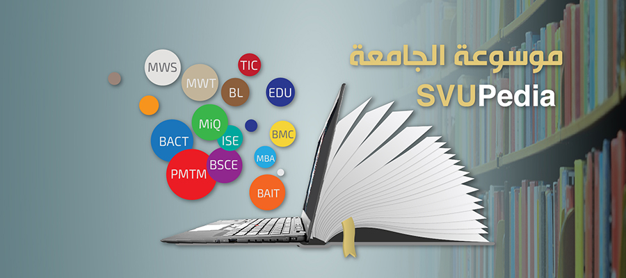
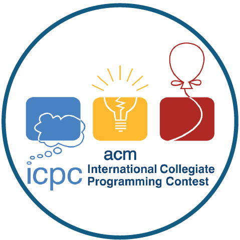

[index.html](https://github.com/user-attachments/files/27555712/index.html)
<!DOCTYPE html>
<!-- Assignment request: Create the main page with SVU branding, featured events, categories, latest events, footer information, and team names with IDs. -->
<html lang="ar" dir="rtl">
<head>
  <meta charset="UTF-8">
  <meta name="viewport" content="width=device-width, initial-scale=1.0">
  <title>دليل فعاليات الجامعة الافتراضية السورية</title>
  <meta name="description" content="موقع بسيط يعرض بعض فعاليات وخدمات الجامعة الافتراضية السورية لمشروع BWP401.">
  <link rel="preconnect" href="https://fonts.googleapis.com">
  <link rel="preconnect" href="https://fonts.gstatic.com" crossorigin>
  <link href="https://fonts.googleapis.com/css2?family=Cairo:wght@400;600;700;800&display=swap" rel="stylesheet">
  <link href="https://cdn.jsdelivr.net/npm/bootstrap@5.3.3/dist/css/bootstrap.rtl.min.css" rel="stylesheet">
  <link rel="stylesheet" href="css/styles.css">
</head>
<body>
  <header class="site-header sticky-top">
    <nav class="navbar navbar-expand-lg">
      

        <a class="navbar-brand brand" href="index.html">
          
          فعاليات SVU
        </a>
        <button class="navbar-toggler" type="button" data-bs-toggle="collapse" data-bs-target="#siteNav" aria-controls="siteNav" aria-expanded="false" aria-label="فتح القائمة">
          
        </button>
        

          <ul class="navbar-nav me-auto gap-lg-2">
            <li class="nav-item"><a class="nav-link active" href="index.html">الرئيسية</a></li>
            <li class="nav-item"><a class="nav-link" href="events.html">الفعاليات</a></li>
            <li class="nav-item"><a class="nav-link" href="event.html">تفاصيل فعالية</a></li>
            <li class="nav-item"><a class="nav-link" href="about.html">عن الموقع</a></li>
            <li class="nav-item"><a class="nav-link" href="contact.html">تواصل معنا</a></li>
            <li class="nav-item"><button class="theme-toggle" type="button" id="themeToggle" aria-label="تبديل الوضع الداكن">☾</button></li>
          </ul>
        

      

    </nav>
  </header>

  <main>
    <section class="hero-band">
      

        

          

            
مشروع مادة BWP401

            <h1>دليل مختصر لبعض أنشطة الجامعة الافتراضية السورية.</h1>
            

              قمنا في هذا الموقع بجمع أمثلة عن فعاليات وخدمات تظهر على موقع الجامعة، مثل أنظمة الطلاب،
              مراكز النفاذ، التدريب، والمبادرات المرتبطة بالجامعة. الهدف هو تقديمها بطريقة مرتبة وسهلة التصفح.
            

            

              <a class="btn btn-primary-svu" href="events.html">عرض الفعاليات</a>
              <a class="btn btn-outline-svu" href="contact.html">صفحة التواصل</a>
            

          

          

            

              <h2>فريق المشروع</h2>
              
الطلاب المشاركون

              <ul>
                <li><strong>الطالب 1:</strong> mahmoud- ID: 188908</li>
                <li><strong>الطالب 2:</strong> mohammed- ID: 245331</li>
                <li><strong>الطالب 3:</strong> asmaa- ID: 294212</li>
                <li><strong>الطالب 4:</strong> aref- ID: 209180</li>
                <li><strong>الطالب 5:</strong> yaman- ID: 233129</li>
              </ul>
            

          

        

      

    </section>

    <section class="section-block">
      

        
      

    </section>

    <section class="section-block pt-0">
      

        

          
فعاليات مختارة

          <h2>أمثلة عن أنشطة يمكن أن يهتم بها الطالب</h2>
        

        

          <article class="feature-slide is-active" data-slide>
            

              

                
              

              

                معرفة وريادة
                <h3>المؤتمر المعارفي السوري</h3>
                
اخترنا هذا المثال لأنه مرتبط بالمعرفة الرقمية وبنشاط الجامعة خارج إطار المحاضرات فقط.

                <a class="btn btn-primary-svu" href="event.html">تفاصيل أكثر</a>
              

            

          </article>
          <article class="feature-slide" data-slide>
            

              

                
              

              

                برمجة
                <h3>المسابقة البرمجية للجامعات</h3>
                
فعالية مناسبة لطلاب المعلوماتية والمهتمين بالبرمجة وحل المسائل ضمن فرق.

                <a class="btn btn-primary-svu" href="event.html">تفاصيل أكثر</a>
              

            

          </article>
          <article class="feature-slide" data-slide>
            

              

                
              

              

                مبادرات
                <h3>مبادرة بناة</h3>
                
مثال على نشاط له جانب اجتماعي، وليس فقط نشاطا تعليميا أو تقنيا.

                <a class="btn btn-primary-svu" href="event.html">تفاصيل أكثر</a>
              

            

          </article>
          

            <button class="btn btn-outline-svu" type="button" id="prevSlide">السابق</button>
            <button class="btn btn-primary-svu" type="button" id="nextSlide">التالي</button>
          

        

      

    </section>

    <section class="section-block pt-0">
      

        

          
تصنيفات

          <h2>قسمنا الفعاليات حسب نوعها ليسهل الوصول إليها</h2>
        

        

          ريادة
          برمجة
          تدريب
          خدمات طلابية
          مبادرات
          خريجون
        

      

    </section>

    <section class="section-block pt-0">
      

        

          
آخر الإضافات

          <h2>بعض العناصر التي أضفناها من موقع الجامعة</h2>
        

        

          

            <article class="card event-card h-100">
              
              

                تدريب
                <h3>دورات مركز التعلم مدى الحياة</h3>
                
وضعنا هذا القسم للدورات التدريبية التي تفيد الطالب خارج الخطة الدراسية الأساسية.

              

            </article>
          

          

            <article class="card event-card h-100">
              
              

                مجتمع
                <h3>التدريب البرمجي للأطفال واليافعين</h3>
                
هذا النشاط يوضح أن الجامعة لديها مبادرات موجهة للمجتمع أيضا.

              

            </article>
          

          

            <article class="card event-card h-100">
              
              

                خدمات
                <h3>تقويم الجامعة</h3>
                
قسم بسيط لمتابعة المواعيد المهمة مثل التسجيل والامتحانات والإعلانات.

              

            </article>
          

        

      

    </section>
  </main>

  <footer class="site-footer">
    

      

        

          <h2>الجامعة الافتراضية السورية</h2>
          
دمشق - الجمهورية العربية السورية | info@svuonline.org | 963 11 2113469+

        

        

          
روابط: Facebook | Instagram | YouTube | LinkedIn

          
مشروع طلابي لمقرر BWP401 - 

        

      

    

  </footer>

  <button class="scroll-top-btn" type="button" id="scrollTopBtn" aria-label="العودة إلى الأعلى">↑</button>
  
  
</body>
</html>
